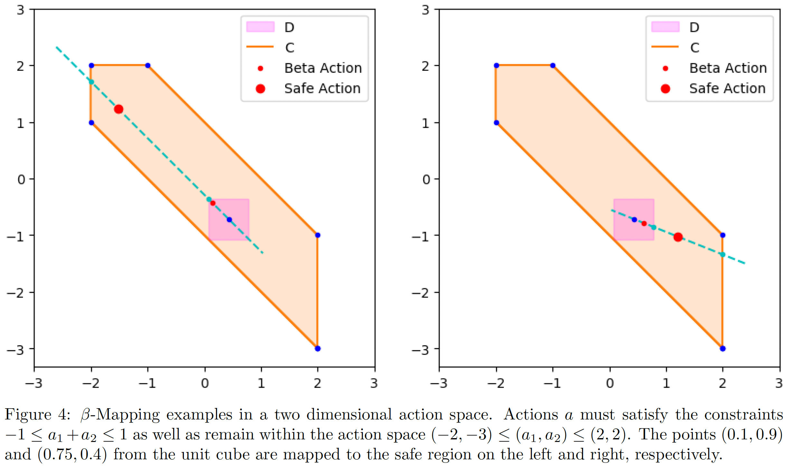

# Beta-Mapping
## Introduction

This repository contains code to run *Beta-Mapping*, an experimental method for constrained reinforcement learning.

Note that this project is still in the experimental stage and the code is not guaranteed to work.

We define a reinforcement learning policy over 
a known safe region . 
Note that it is necessary that the region 

 is convex; in this work, we also assume that 
 
  is defined by a set of inequalities, linear in the action 
  , and is bounded. 
  In environments with bounded action spaces, augmenting the set of inequalities with the action space bounds easily satisfies this latter requirement. 

The basic idea to define a policy over a safe region is to select actions from the beta distribution, defined over 
. 
Actions are then mapped to an action

in the cube 

that is a subset of the safe region 
. Finally, actions are scaled from 

 to 
 
along the line 

 interpolating
  
 and 
  
 with the safe region action 
 
  depending on the factor 
  
   that ensures that the distance between 
   
    and the intersection of 
    
     with the boundary of 
     
      is proportional to the distance between 
      
       and the intersection of 
       
        with the boundary of 
        
        . An example of this mapping is shown in the figure below.

Note that, crucially, the mapping 

 is bijective -- each action 
  
 selected by the agent from the beta-parameterized policy is mapped to a unique action 
 
  in the constrained region. Because of this bijection, there is no bias in projection: 
  .

This repository contains code from the [Safe Explorer project](https://github.com/AgrawalAmey/safe-explorer),
in the safe_explorer folder.

